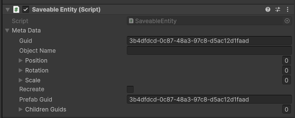

# How To Use

A step-by-step guide to adding Metadata Saver to your own Unity project. Back to the [README](README.md).

## Contents

1. [Install](#1-install)
2. [Add the SaveLoadManager](#2-add-the-saveloadmanager)
3. [Make an object saveable](#3-make-an-object-saveable)
4. [Save your own data](#4-save-your-own-data)
5. [Objects spawned at runtime (Recreate)](#5-objects-spawned-at-runtime-recreate)
6. [Saving ScriptableObject references](#6-saving-scriptableobject-references)
7. [Parent / child objects](#7-parent--child-objects)
8. [Triggering save & load](#8-triggering-save--load)
9. [API reference](#9-api-reference)
10. [Troubleshooting](#10-troubleshooting)

---

## 1. Install

### Option A: Unity package (recommended)

1. Download the `.unitypackage` from the [latest release](https://github.com/Oxyjon/Unity-Metadata-Saver/releases/latest).
2. In Unity, go to **Assets > Import Package > Custom Package...** and select the file (or double-click it).
3. Click **Import**. Untick the example items (`ExampleScripts`, `Scenes`, `Art`, and the sample prefabs/data in `Resources`) if you only want the core system.

### Option B: Copy from source

Copy `Assets/MetadataSaver` from this repository into your project's `Assets` folder.
   - **Required:** `Scripts/SaveLoad`, `JsonDotNet`, `Prefabs/Managers`
   - **Optional:** `ExampleScripts`, `Scenes`, `Art`, and the example prefabs/data in `Resources`

### After installing

Let Unity compile. All scripts use the namespace `SaveLoad`, so add this to your scripts:

```csharp
using SaveLoad;
```

## 2. Add the SaveLoadManager

Drag `Assets/MetadataSaver/Prefabs/Managers/SaveLoadManager.prefab` into your **first scene**.

It is a singleton (`SaveLoadManager.Instance`) and persists between scenes. If a second one appears it destroys itself.

| Inspector field | Meaning |
| --- | --- |
| **Encrypt** | `true` (default) writes the file as Base64; `false` writes readable indented JSON. Handy to turn **off** while debugging. |

## 3. Make an object saveable

Select a GameObject and click **Add Component > Saveable Entity**.



| Field | Meaning |
| --- | --- |
| **Guid** | Unique ID for this object. Generated automatically when the component is added. |
| **Object Name** | Filled in automatically when saving. Leave empty. |
| **Position / Rotation / Scale** | Filled in automatically when saving. Leave empty. |
| **Recreate** | Tick if this object is a **prefab that gets spawned at runtime**. See [section 5](#5-objects-spawned-at-runtime-recreate). Leave unticked for objects already placed in the scene. |
| **Prefab Guid** | Identifies the prefab. Equal to `Guid` on the prefab asset. Don't edit. |
| **Children Guids** | Filled in automatically when saving. Leave empty. |

That's all you need for an object whose **position, rotation and scale** should persist. Enter Play mode, move it, save, move it again, load, and it snaps back.

> [!IMPORTANT]
> Scene objects (Recreate **off**) are matched on load by their **Guid**. Don't duplicate a saveable object in the scene by copy/paste without checking that the copy got its own unique Guid, otherwise two objects will share the same ID.

## 4. Save your own data

Transform data is automatic. For anything else (health, score, state...), write a script that listens to two events on `SaveableEntity`:

| Event | When it fires | What to do |
| --- | --- | --- |
| `prepareToSave` | Just before writing the file | **Write** your values into `metaData.baseValues` |
| `loadObjectState` | After load (one frame later) | **Read** your values back out of `metaData.baseValues` |

`IJSaveable` is a convenience interface that defines matching method names. You don't have to use it, but it keeps things consistent.

### Example: a player with health

```csharp
using System;
using SaveLoad;
using UnityEngine;

public class Player : MonoBehaviour, IJSaveable
{
    public int health = 100;
    public string playerName = "Hero";

    private SaveableEntity saveableEntity;

    private void Start()
    {
        saveableEntity = GetComponent<SaveableEntity>();

        // Subscribe to the save/load events
        saveableEntity.prepareToSave += PrepareToSaveObjectState;
        saveableEntity.loadObjectState += LoadObjectState;
    }

    private void OnDestroy()
    {
        // Good practice: unsubscribe
        if (saveableEntity != null)
        {
            saveableEntity.prepareToSave -= PrepareToSaveObjectState;
            saveableEntity.loadObjectState -= LoadObjectState;
        }
    }

    // Called right before saving
    public void PrepareToSaveObjectState(MetaData metaData)
    {
        metaData.baseValues["Player.health"] = health;
        metaData.baseValues["Player.name"] = playerName;
    }

    // Called after loading
    public void LoadObjectState(MetaData metaData)
    {
        health = Convert.ToInt32(metaData.baseValues["Player.health"]);
        playerName = Convert.ToString(metaData.baseValues["Player.name"]);
    }
}
```

Attach `Player` **and** `SaveableEntity` to the same GameObject.

### Tips for `baseValues`

- **Prefix your keys** (`"Player.health"`, not `"health"`) so different scripts on the same object don't overwrite each other.
- Values are stored as JSON, so after loading, numbers may be `long` or `double`. Always convert: `Convert.ToInt32`, `Convert.ToSingle`, `Convert.ToBoolean`, `Convert.ToString`.
- Use `ContainsKey` before reading values that might not exist in older save files.
- Unity types such as `Vector3`, `Vector2` and `Quaternion` don't serialise well. Use the helpers on `SaveLoadManager`:

```csharp
// Save
metaData.baseValues["Enemy.target"] = SaveLoadManager.ConvertFromVector3(targetPos);

// Load  (value comes back as a JSON array, so cast it)
var arr = ((Newtonsoft.Json.Linq.JArray)metaData.baseValues["Enemy.target"]).ToObject<float[]>();
Vector3 targetPos = SaveLoadManager.ConvertToVector3(arr);
```

Available helpers: `ConvertFrom/ToVector3`, `ConvertFrom/ToVector2`, `ConvertFrom/ToQuaternion`, and the `...Vector3Array` / `...Vector2Array` variants.

## 5. Objects spawned at runtime (Recreate)

Some objects don't exist in the scene until the game spawns them (enemies, pickups, the cubes in the demo). To save and restore them:

1. Make a prefab with a **Saveable Entity** component.
2. Tick **Recreate** on the prefab.
3. Place the prefab in a **`Resources/Prefabs/`** folder (sub-folders are fine, e.g. `Resources/Prefabs/Objects/`).
4. Spawn it normally with `Instantiate(...)`.

What happens behind the scenes:

- On `Start`, the spawned copy is given a **new unique Guid**, while `Prefab Guid` keeps pointing at the prefab.
- On **Load**, every object with `Recreate = true` is **destroyed**, then re-instantiated from the prefab matching its `Prefab Guid`, with its saved transform and `baseValues`.
- Objects with `Recreate = false` are found by Guid and just have their state restored.

> [!WARNING]
> Every re-creatable prefab needs a **unique** `Prefab Guid`. If you duplicate a prefab asset, make sure the copy gets a different Prefab Guid (remove and re-add the `SaveableEntity` component to regenerate one). Prefabs without a `SaveableEntity` in `Resources/Prefabs/` are skipped with a warning.

## 6. Saving ScriptableObject references

You can't store a reference to an asset in JSON, but you can store its **name** and look it up again on load. The demo `Cube` does this to remember its material:

1. Put your ScriptableObjects in **`Resources/Data/`** (names must be unique).
2. Save the name, and fetch the asset on load with `SaveLoadManager.Instance.GetScriptableByName(...)`:

```csharp
public void PrepareToSaveObjectState(MetaData metaData)
{
    metaData.baseValues["Cube.material"] = renderer.material.name.Replace(" (Instance)", "");
}

public void LoadObjectState(MetaData metaData)
{
    if (metaData.baseValues.ContainsKey("Cube.material"))
    {
        string materialName = Convert.ToString(metaData.baseValues["Cube.material"]);
        MaterialData data = SaveLoadManager.Instance.GetScriptableByName(materialName) as MaterialData;
        renderer.material = data.material;
    }
}
```

> The `Replace(" (Instance)", "")` is needed because Unity appends that suffix to runtime material copies.

## 7. Parent / child objects

If a **child** GameObject also has a `SaveableEntity`, it's saved along with its parent (its Guid is recorded in the parent's `Children Guids`). On load, children are re-attached to their parent automatically.

- Children without a `SaveableEntity` are ignored.
- Only **direct** children are listed in `Children Guids`, but the whole tree is traversed recursively.

## 8. Triggering save & load

`SaveLoadManager` ships with two debug hotkeys: **7** to save, **8** to load. For a real game, call the public methods from your own UI or code:

```csharp
SaveLoadManager.Instance.Save();                    // write the save file
SaveLoadManager.Instance.Load();                    // restore from the save file

if (SaveLoadManager.Instance.SaveFileExists())      // e.g. enable a "Continue" button
{
    // ...
}

SaveLoadManager.Instance.DeleteSave();              // delete the save file
```

You can also right-click the `SaveLoadManager` component in the Inspector and choose **Save** or **Load** from the context menu.

> [!NOTE]
> To remove the hotkeys, delete the `Update()` method in [`SaveLoadManager.cs`](Assets/MetadataSaver/Scripts/SaveLoad/SaveLoadManager.cs). It uses the legacy `Input` class, which won't work if your project is set to *Input System Package (New)* only.

## 9. API reference

### `SaveLoadManager`

| Member | Description |
| --- | --- |
| `static SaveLoadManager Instance` | The singleton. |
| `bool encrypt` | Base64-encode the save file (not secure). |
| `void Save()` | Save every `SaveableEntity` in the scene to `save.json`. |
| `void Load()` | Load `save.json` and restore the scene. |
| `bool SaveFileExists()` | Does a save file exist? |
| `void DeleteSave()` | Delete the save file. |
| `GameObject GetPrefabByName(string guid)` | Get a prefab from `Resources/Prefabs` by its **Prefab Guid**. |
| `ScriptableObject GetScriptableByName(string name)` | Get a ScriptableObject from `Resources/Data` by name. |
| `SaveableEntity FindSaveableEntityByGuid(string guid)` | Find a scene object by Guid. |
| `ConvertFrom/To Vector3, Vector2, Quaternion (+ arrays)` | Static helpers for JSON-friendly conversion. |

### `SaveableEntity`

| Member | Description |
| --- | --- |
| `MetaData metaData` | The data record for this object. |
| `event prepareToSave(MetaData)` | Raised before saving. Write to `baseValues`. |
| `event loadObjectState(MetaData)` | Raised after loading. Read from `baseValues`. |

### `MetaData`

| Field | Description |
| --- | --- |
| `guid` | Unique ID of this object instance. |
| `prefabGuid` | ID of the source prefab. |
| `recreate` | Re-instantiate from the prefab on load. |
| `objectName`, `position`, `rotation`, `scale` | Transform info (automatic). |
| `childrenGuids` | Guids of saveable children (automatic). |
| `Dictionary<string, object> baseValues` | **Your custom data.** |

## 10. Troubleshooting

| Problem | Likely cause / fix |
| --- | --- |
| `NullReferenceException` on `SaveLoadManager.Instance` | There is no `SaveLoadManager` in the scene. Add the prefab. |
| `Prefab with guid ... not found` on load | The prefab isn't under `Resources/Prefabs/`, or has no `SaveableEntity`, or `Recreate` is ticked on an object that isn't a prefab. |
| `Prefab guid are the same` error on save | A `Recreate` object still has `Guid == Prefab Guid` (a fresh Guid is only assigned in `Start`). This happens if you save in the same frame the object is spawned. Wait a frame before saving. |
| `Saveable entity with guid ... not found` | A scene object that existed when you saved is missing now. |
| `File ... not found` | Nothing has been saved yet. Save first. |
| `KeyNotFoundException` in `LoadObjectState` | The key wasn't saved (e.g. an old save file). Check with `ContainsKey`. |
| Custom values don't restore | Make sure you subscribed to **both** events and that the script is on the same GameObject as the `SaveableEntity`. |
| Save file is unreadable | `Encrypt` is on (Base64). Turn it off to see plain JSON. |
| Hotkeys do nothing | Project is set to the new Input System only. Call `Save()` / `Load()` yourself. |
