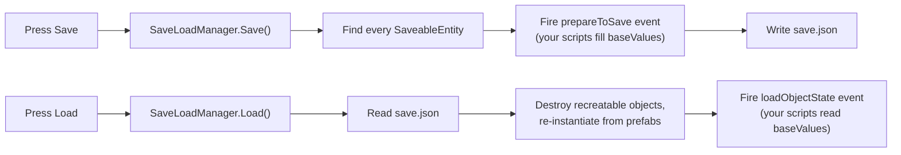

# Unity Metadata Saver

A small, drop-in save/load system for Unity. Add a `SaveableEntity` component to any GameObject and its **transform, name, hierarchy and your own custom values** are written to a JSON save file, then restored on load. This includes objects that were spawned at runtime from prefabs.

> **Tested with:** Unity `6000.0.32f1` (Unity 6). The scripts use only core Unity APIs and the bundled Newtonsoft.Json, so older versions should work too, but they haven't been tested.

---

## Features

- **One component to opt in** - add `SaveableEntity` to a GameObject and it gets saved.
- **Saves transform data automatically** - position, rotation, scale and object name.
- **Custom data** - store any value you like in a `baseValues` dictionary (health, score, material name, etc.).
- **Runtime-spawned objects** - tick `Recreate` and the object is re-instantiated from its prefab on load.
- **Parent/child hierarchies** - saveable children are saved and re-parented on load.
- **ScriptableObject lookup** - save a ScriptableObject's *name* and fetch it again on load.
- **JSON save file** with optional Base64 obfuscation.
- **Vector/Quaternion helpers** for converting Unity types to JSON-friendly arrays.

## How it works



| Script | Role |
| --- | --- |
| [`SaveableEntity.cs`](Assets/MetadataSaver/Scripts/SaveLoad/SaveableEntity.cs) | The component you add to GameObjects. Holds a `MetaData` and exposes the `prepareToSave` / `loadObjectState` events. |
| [`MetaData.cs`](Assets/MetadataSaver/Scripts/SaveLoad/MetaData.cs) | The serialisable data record for one object (GUIDs, transform, children, `baseValues`). Also contains the static save/load logic. |
| [`SaveLoadManager.cs`](Assets/MetadataSaver/Scripts/SaveLoad/SaveLoadManager.cs) | Singleton that loads prefabs/ScriptableObjects from `Resources`, reads/writes the file and exposes `Save()` / `Load()`. |
| [`IJSaveable.cs`](Assets/MetadataSaver/Scripts/SaveLoad/IJSaveable.cs) | Optional interface that gives your scripts the two callbacks to implement. |

## Download

Grab the latest `.unitypackage` from the **[Releases page](https://github.com/Oxyjon/Unity-Metadata-Saver/releases/latest)**.

### Install the package

1. Download the `.unitypackage` file from the latest release.
2. In Unity, open your project and choose **Assets > Import Package > Custom Package...** (or just double-click the downloaded file).
3. Leave everything ticked and click **Import**. Untick the `ExampleScripts`, `Scenes`, `Art`, `Resources` items if you don't want the demo.

> Prefer to browse the source? Clone this repository and copy `Assets/MetadataSaver` into your own project instead. `Scripts/SaveLoad` and `JsonDotNet` are the required parts.

## Quick start

1. [Import the package](#install-the-package) into your project.
2. Drag `Assets/MetadataSaver/Prefabs/Managers/SaveLoadManager.prefab` into your scene.
3. Add a **Saveable Entity** component to any object you want saved.
4. Enter Play mode, press **7** to save and **8** to load.

For the full walkthrough (custom data, runtime-spawned prefabs, ScriptableObjects, children), see **[How To Use](HowToUse.md)**.

## Demo scene

Open `Assets/MetadataSaver/Scenes/DemoScene.unity`.

| Key | Action |
| --- | --- |
| `1` | Spawn a cube at a random point on the plane |
| `2` | Change the material of every cube |
| `W A S D` | Move the sphere |
| `7` | **Save** the game |
| `8` | **Load** the game |

Save, spawn/modify some objects, then load. The scene should return to the saved state.

## Where is the save file?

```
<Application.persistentDataPath>/save.json
```

On Windows this is usually `%USERPROFILE%\AppData\LocalLow\<Company>\<Product>\save.json`.

## Project layout

```
Assets/MetadataSaver/
├── JsonDotNet/          Newtonsoft.Json (bundled)
├── Prefabs/Managers/    SaveLoadManager prefab
├── Resources/
│   ├── Prefabs/         Prefabs that can be re-created on load
│   └── Data/            ScriptableObjects that can be looked up by name
├── Scenes/              DemoScene
└── Scripts/
    ├── SaveLoad/        The save system itself
    └── ExampleScripts/  Cube, Sphere, CubeSpawner, MaterialData
```

## Requirements & limitations

- `SaveLoadManager` must exist in the scene (it becomes a `DontDestroyOnLoad` singleton).
- Prefabs that need to be re-created **must** live under a `Resources/Prefabs/` folder; ScriptableObjects under `Resources/Data/`.
- ScriptableObject **names must be unique**.
- The built-in `encrypt` option is **Base64 encoding, not real encryption**. It only stops casual editing; don't rely on it for security.
- Save/Load keys (`7` / `8`) are hard-coded in `SaveLoadManager.Update()` using the legacy `Input` class. Call `Save()` / `Load()` from your own UI or input code and remove those lines if you prefer.
- Numbers loaded from JSON may come back as `long`/`double`, so read them with `Convert.ToInt32(...)` etc. (see the examples).

## License

Released under [CC0 1.0 Universal](LICENSE) (public domain).